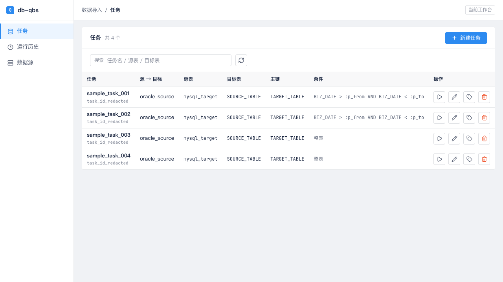
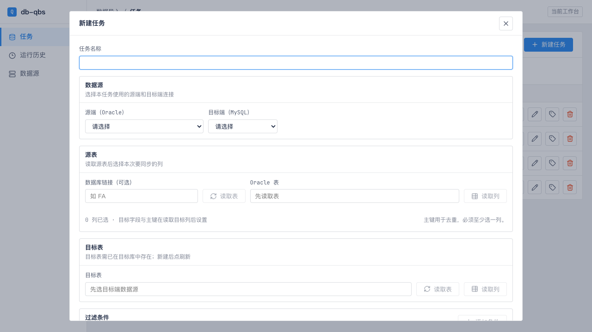
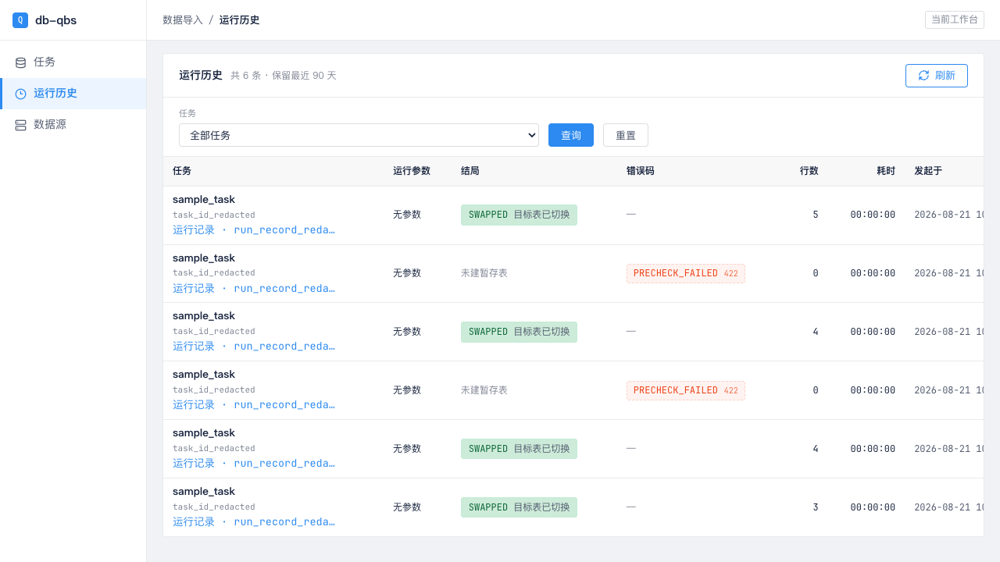
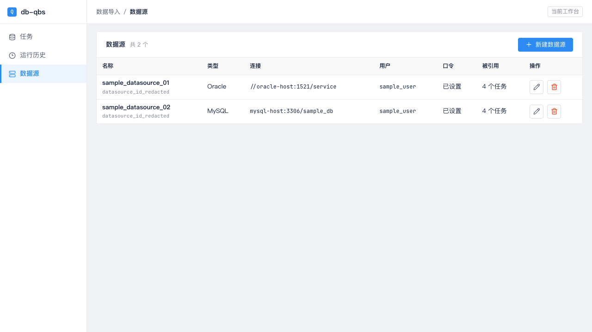

# P1 Claude Code Handoff

## Objective

Implement P1 frontend improvements for db-qbs using the x2doris-style list workflow as reference. Keep business functionality unchanged and verify in local mode only.

P1 is about operational density and usability of the current frontend:

- Task list filters, latest run summary, and client-side pagination.
- Run history filters, status filter, column order cleanup, and client-side pagination.
- Datasource row-level test connection action.
- Small copy and interaction refinements that support those changes.

Do not deploy to the POC environment. Do not use the remote Oracle/MySQL POC servers. Do not change backend behavior unless a small API typing change is strictly required by existing endpoints.

## Baseline

P0 has already been implemented locally before this handoff:

- The target-table DDL / create-table UI entry has been removed.
- Target tables are assumed to already exist in MySQL.
- The UI keeps refresh controls for target table lists and target columns.
- Field mapping appears only after target columns are fetched.
- The sidebar no longer shows non-v1 placeholder modules.
- Visible internal copy was reduced.

Treat the current working tree as the intended baseline. Preserve those P0 decisions.

Relevant P0 files already changed:

- `web/src/App.tsx`
- `web/src/HistoryScreen.tsx`
- `web/src/RunScreen.tsx`
- `web/src/StartRunDialog.tsx`
- `web/src/DatasourceScreen.tsx`
- `web/src/app.css`
- `web/src/history.ts`
- `web/src/spec.ts`

Reference notes:

- `docs/prototypes/p1-x2doris-reference.md`
- `docs/design-system/README.md`
- `docs/design-system/tokens.css`

Screenshot references:

- x2doris target patterns:
  - `docs/prototypes/assets/x2doris-job-center-redacted.png`
  - `docs/prototypes/assets/x2doris-add-new-menu-redacted.png`
  - `docs/prototypes/assets/x2doris-job-workflow-redacted.png`
  - `docs/prototypes/assets/x2doris-datasource-list-redacted.png`
- current db-qbs P0 baseline:
  - `docs/prototypes/assets/db-qbs-p0-task-list-redacted.png`
  - `docs/prototypes/assets/db-qbs-p0-task-modal-redacted.png`
  - `docs/prototypes/assets/db-qbs-p0-history-list-redacted.png`
  - `docs/prototypes/assets/db-qbs-p0-datasource-list-redacted.png`

The screenshots are redacted layout references. Use them for structure and density, not for exact data or wording.

## Visual Targets

### Target Pattern: x2doris Job Center


Use this as the main P1 alignment target for `#/tasks`: filter strip above the table, compact table card, toolbar actions, latest status column, and pagination.

### Target Pattern: x2doris Add New Menu


Use this only as a negative reference for db-qbs P1: x2doris has multiple source types, but db-qbs v1 should not add a multi-type task menu.

### Target Pattern: x2doris Job Workflow


Use this as P2 context only. Do not implement the page-level task workflow in P1.

### Target Pattern: x2doris Datasource List


Use this to understand the datasource list density and row actions. For db-qbs P1, add row-level test connection but do not add heavy datasource filters.

### Current Baseline: db-qbs Task List



P1 should replace the single search box with a fuller filter strip, add latest run status, and add client-side pagination.

### Current Baseline: db-qbs Task Modal



Preserve the P0 target-table boundary shown here: target tables must already exist, target metadata can be refreshed, and field mapping appears after target columns are read. Do not reintroduce target DDL.

### Current Baseline: db-qbs Run History



P1 should add status filtering and pagination while preserving the expanded detail behavior.

### Current Baseline: db-qbs Datasource List



P1 should add row-level test connection in this table, with transient inline success/failure result.

## Non-goals

- No POC deployment.
- No remote environment verification.
- No auth or login page.
- No automatic target table creation.
- No generated target DDL UI.
- No page-level task editor in P1. Keep the current modal architecture.
- No new source/target database types.
- No Ant Design migration.
- No backend server-side pagination unless explicitly requested later.
- No route overhaul such as `#/tasks/:id/edit` or `#/runs/:id` in this P1 slice.

## Scope

### 1. Task List

File likely involved:

- `web/src/App.tsx`
- `web/src/app.css`
- possibly a small helper module under `web/src/`

Replace the bare search toolbar with an x2doris-like filter strip:

- `任务名` text input.
- `源端` select.
- `目标端` select.
- `最近状态` select.
- `查询` and `重置` buttons.

Filtering should be client-side over the loaded `tasks`.

`最近状态` options should be derived from latest run data:

- 全部
- 成功
- 失败
- 进行中
- 结局不明
- 尚未运行

Add a `最近运行` column:

- Show status/conclusion from the latest history row for that task.
- Show start time or finish time as a small secondary line.
- If no history row exists, show `尚未运行`.
- Reuse existing presentation logic from `web/src/history.ts` where possible.
- Do not collapse db-qbs three-axis state semantics into one generic colored tag.

Implementation guidance:

- Fetch run history once on the task page using existing `listRunHistory({})`.
- Join latest history row by `task_id` client-side.
- Do not auto-refresh the task list.
- If history fetch fails, task list should still render; show latest run as `读取失败` or a quiet neutral fallback.
- Keep row actions: 发起运行 / 编辑 / 改名 / 删除.
- Make row-level `发起运行` more prominent than rename/delete. It may be a labelled ghost button rather than a bare icon button.

Add client-side pagination:

- Default page size: 20.
- Show `共 N 条`.
- Hide pagination when total rows <= page size.
- Reset to page 1 when filters change or reset.
- Do not imply server-side pagination.

### 2. Run History

Files likely involved:

- `web/src/HistoryScreen.tsx`
- `web/src/history.ts`
- `web/src/app.css`
- tests under `web/src/*.test.ts`

P0 already added explicit `查询 / 重置` for task filter. P1 should complete the x2doris-style list pattern:

- Add status filter.
- Keep task filter.
- Use explicit `查询 / 重置`.
- Add client-side pagination.
- Reorder table columns for scanning:
  - 任务
  - 结局
  - 错误码
  - 行数
  - 耗时
  - 发起于
  - 操作
  - 展开详情
- Keep full IDs in expanded detail, not as the first columns.

Suggested status filter buckets:

- 全部
- 成功
- 失败
- 进行中
- 结局不明

Status filter should be derived with `historyPresentation(row)`.

Expanded detail:

- Keep row-level detail expansion.
- Keep the existing three-axis components and error-code tags.
- Keep the source SQL preview and metrics.
- Do not add a routed run detail page in P1.

### 3. Datasource Row Test

Files likely involved:

- `web/src/DatasourceScreen.tsx`
- `web/src/api.ts`
- `web/src/app.css`

Add row-level `测试连接` action in the datasource table:

- Reuse existing `testDatasource(datasourceId)` API if available.
- Show an inline transient result per row:
  - `连接成功 · <ms> ms · <label>`
  - or driver error text.
- Do not use run error-code tags for datasource test results.
- Do not add a heavy filter form to datasource list.
- Keep create/edit dialog behavior: save requires a successful test for changed connection fields.

Interaction details:

- While testing one row, only that row action should show loading/disabled.
- Other rows remain usable.
- A new test result replaces the old result for that row.
- Editing or deleting a datasource should clear its row-level result if it becomes stale.

### 4. Copy Cleanup While Touching P1 Areas

Keep user-visible copy concise. Avoid:

- ADR ids.
- `source` / `sink` when they mean internal agent names.
- `SQLite`.
- raw field labels such as `run_record_id`, `run_params`, `fetch_ms`.
- implementation rationale in visible helper text.

Prefer:

- `运行记录`
- `运行参数`
- `目标端运行号`
- `行数核对`
- `源端读取`
- `目标端回报`
- `状态可能有延迟，以发起结果为准。`

Do not mass-edit code comments unless they are wrong. The priority is user-visible text.

## Local Mode Verification

Use local verification only.

Mandatory commands:

```bash
npm run typecheck
npm test -- --run
npm run build
```

Recommended local visual smoke:

```bash
npm run dev -- --host 127.0.0.1
```

Then open the Vite local URL. If API data is needed for visual checks, use Playwright network mocks or local fixtures. Do not call the POC hosts.

Visual checks to perform:

- `#/tasks`
  - Filter strip is visible.
  - Query/reset works.
  - Latest run column renders for rows with and without history.
  - Pagination appears only when needed.
  - Row actions remain usable.
- `#/history`
  - Task and status filters are visible.
  - Query/reset works.
  - Pagination works.
  - Expanded detail still renders metrics and source SQL.
- `#/datasources`
  - Row-level test connection action works.
  - Existing create/edit/delete still work.

Local test notes:

- Prefer unit tests for filter, pagination, and latest-run derivation.
- If a helper grows beyond trivial inline logic, extract it to a small pure module and test it.
- Do not require Docker local rig for this P1 frontend slice unless you intentionally touch backend behavior.
- Do not run remote POC E2E.

## Suggested Implementation Shape

### Pure helpers

Consider extracting small helpers, for example:

- `taskFiltersFromDatasources`
- `latestRunByTask`
- `taskMatchesFilters`
- `paginate`
- `historyMatchesFilters`

Keep helpers boring and typed. Tests should cover:

- empty arrays
- unknown datasource ids
- no history for task
- multiple history rows per task
- live vs failed vs unknown history rows
- page reset behavior through component-level state where practical

### CSS

Reuse existing classes first:

- `.history-filters`
- `.filter-field`
- `.data-grid`
- `.row-actions`
- `.card-header`
- `.button`

Add only small generic classes when needed:

- pagination footer
- latest-run cell
- datasource row test result

Avoid nested cards.

## Acceptance Criteria

P1 is complete when:

- Task page has x2doris-style filters, latest run column, and client-side pagination.
- History page has task/status filters and client-side pagination.
- Datasource rows have a test connection action.
- P0 target-table behavior remains unchanged.
- No create-table or target DDL UI is reintroduced.
- Local mandatory commands pass.
- A short local visual check is documented in the final response.

## Git / PR Guidance

Commit these docs with the P1 change so Claude Code or any reviewer can understand the reference after a fresh clone:

- `docs/prototypes/p1-claude-code-handoff.md`
- `docs/prototypes/p1-x2doris-reference.md`

Do not commit:

- `.playwright-cli/`
- `docs/poc/` artifacts unless the PR is explicitly about the POC report.
- credentials or internal x2doris URL.
- screenshots unless they are explicitly reviewed and redacted.

Suggested PR title:

```text
Improve v1 frontend list workflows using x2doris-style P1 patterns
```

Suggested PR checklist:

- [ ] No target DDL / create-table UI reintroduced.
- [ ] Local typecheck passed.
- [ ] Local tests passed.
- [ ] Local production build passed.
- [ ] Task list visual smoke checked.
- [ ] History list visual smoke checked.
- [ ] Datasource row test visual smoke checked.
- [ ] No credentials or internal URLs committed.
