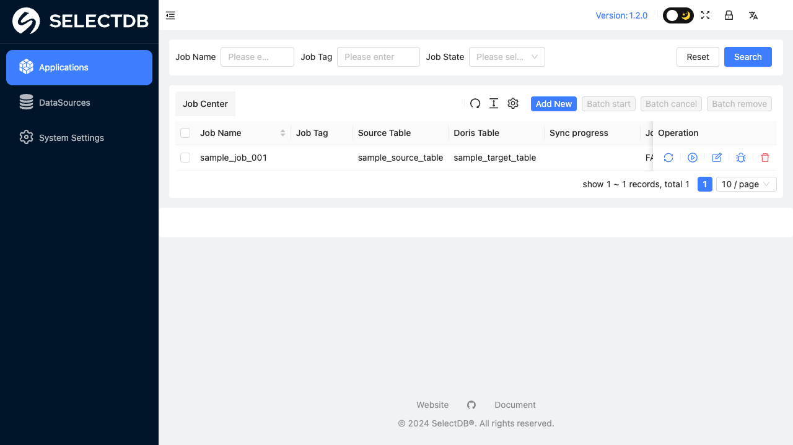
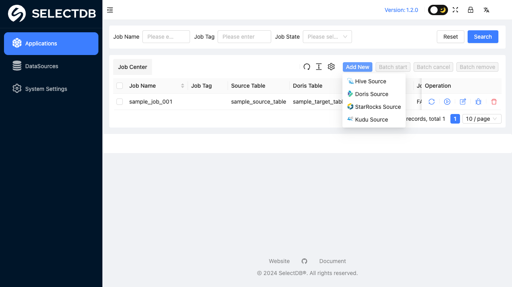
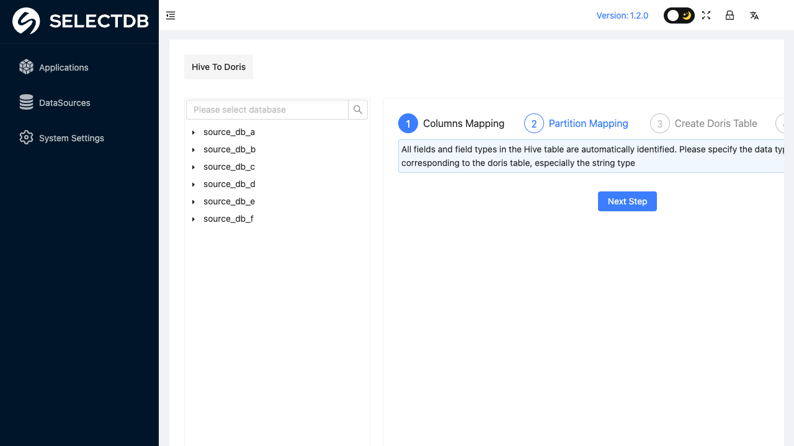
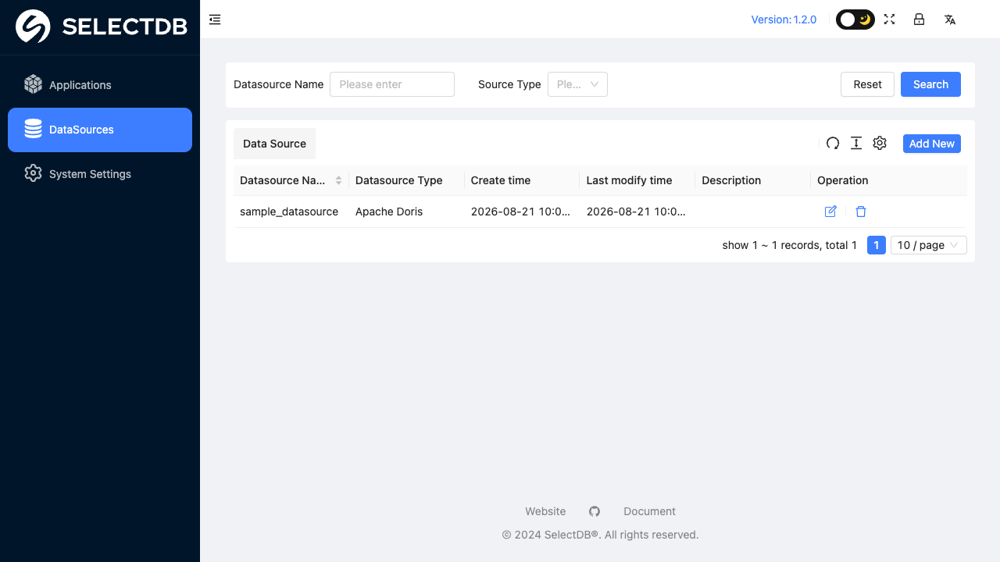

# P1 x2doris Reference Notes

本文件给 P1 前端改造提供可提交 Git 的参考资料。它只记录可复用的界面模式，不包含内网地址、账号、密码、客户数据或截图。

## 参考结论

x2doris 对 db-qbs 最有价值的不是视觉换皮，而是同步产品的中后台信息架构：

- 左侧固定模块导航。
- 顶部轻量工具栏。
- 列表页以筛选区 + 表格卡片 + 工具按钮 + 分页为核心。
- 任务创建是面向同步作业的配置流程，而不是通用调度系统。
- 页面文字短、直接，偏操作说明，不解释实现原因。

db-qbs 已经有相近的浅色中后台外壳，所以 P1 不需要引入 Ant Design，也不需要重做品牌视觉。

## 截图索引

以下截图通过 Playwright 采集，并已去敏：保留布局、表头、工具区和控件结构，具体任务名、数据源名、库表名、用户名均替换为示例文本。

### x2doris Job Center

重点观察：

- 筛选条位于表格卡片上方。
- 表格标题与刷新、密度、列设置、新建等工具按钮在同一行。
- 分页明确显示总数与 page size。
- 行操作集中在最右侧。

### x2doris Add New Menu

重点观察：

- x2doris 使用多源类型下拉。
- db-qbs v1 不应照搬这一点，因为当前产品固定 Oracle 到 MySQL。

### x2doris Job Workflow

重点观察：

- 左侧是数据源 / 库表资源树。
- 右侧是作业配置步骤。
- 这是 db-qbs P2 页面级任务编辑器的重要参考，P1 只记录方向，不实现该结构。

### x2doris Datasource List

重点观察：

- 数据源页仍是筛选条 + 表格卡片结构。
- db-qbs 的数据源数量较少，P1 只复制行内操作思路，不强行复制复杂筛选。

## 可复制的模式

### Job Center 列表模式

用于 `#/tasks`：

- 顶部标题显示任务总数。
- 标题右侧保留主操作：新建任务。
- 标题下方是筛选条，而不是单个搜索框。
- 筛选项建议：任务名、源端、目标端、最近状态。
- 筛选条右侧使用“查询 / 重置”。
- 表格卡片展示核心字段，行尾是明确操作。
- 分页在表格底部，显示总数和当前页。

### Run History 列表模式

用于 `#/history`：

- 顶部标题显示历史总数与保留期限。
- 筛选项建议：任务、状态。
- 筛选操作必须显式：查询 / 重置。
- 表格首列应是任务与运行记录，不要把裸 `RUN_RECORD_ID` / `RUN_ID` 放在前两列。
- 详情里再展示完整 ID、行数核对、分段耗时、源端 SQL。

### Datasource 列表模式

用于 `#/datasources`：

- 数据源数量通常较少，不需要为了模仿 x2doris 强行加复杂筛选。
- 可复制的是行内“测试连接”操作。
- 新建 / 编辑 / 删除保持当前结构。

## 不要复制的模式

- 登录页或用户菜单：db-qbs 当前无鉴权，不能伪造登录体验。
- 批量运行 / 批量删除：db-qbs 任务会改写目标表，批量操作风险过高。
- “Add New” 多源类型菜单：db-qbs v1 固定 Oracle 到 MySQL。
- 目标表建表步骤：v1 明确不提供自动建表，也不提供建表 SQL 入口。
- 分区映射、资源配置、作业并发配置：当前 `TaskSpec` 没有对应语义。
- 服务端分页假象：当前 API 没有 `limit/offset`，P1 只能做客户端分页。
- 简化三轴状态为单个彩色标签：db-qbs 的运行状态、目标表效果、错误码语义已经有明确区分。

## P1 视觉语气

- 保持简洁、密集、工作台式布局。
- 控件高度、圆角、表格行高继续使用现有 token。
- 文案优先说“下一步怎么做”，少说“为什么这么设计”。
- 用户可见文字里不要出现 ADR、SQLite、source/sink、内部字段名、实现理由。
- 图标按钮用于次要动作；行内主动作可以用带文字按钮。

## 是否把 x2doris 资料提交 Git

建议提交这类资料：

- 本文件这样的去敏文字摘要。
- 手工重画的低保真结构示意图。
- 不含客户数据、账号、URL、真实表名的裁剪截图。

不建议提交：

- 内网地址、登录凭据。
- 未打码截图。
- 客户任务名、数据源名、数据库地址。
- 任何只能在内网访问的链接作为唯一依据。

如果后续需要截图，建议放在 `docs/prototypes/assets/`，文件名使用语义名，例如 `x2doris-job-center-redacted.png`，并在 PR 中说明已去敏。
